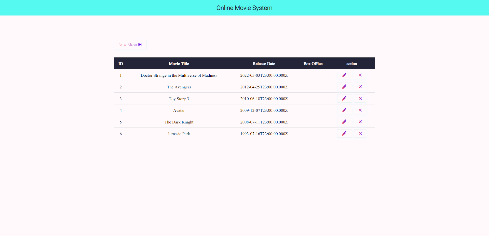
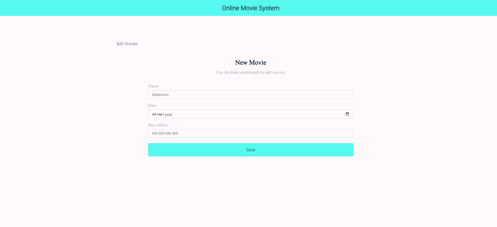
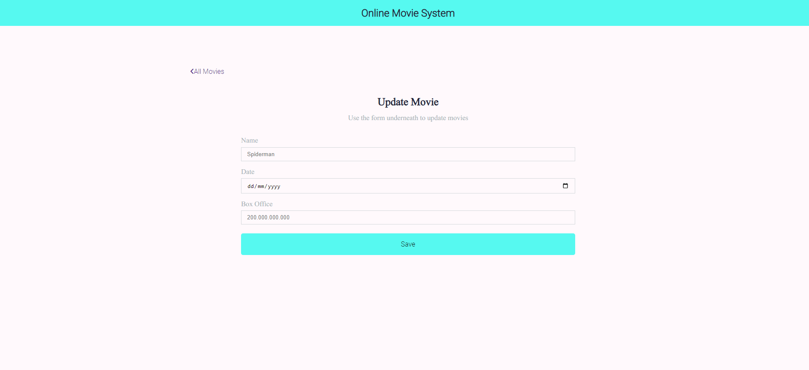
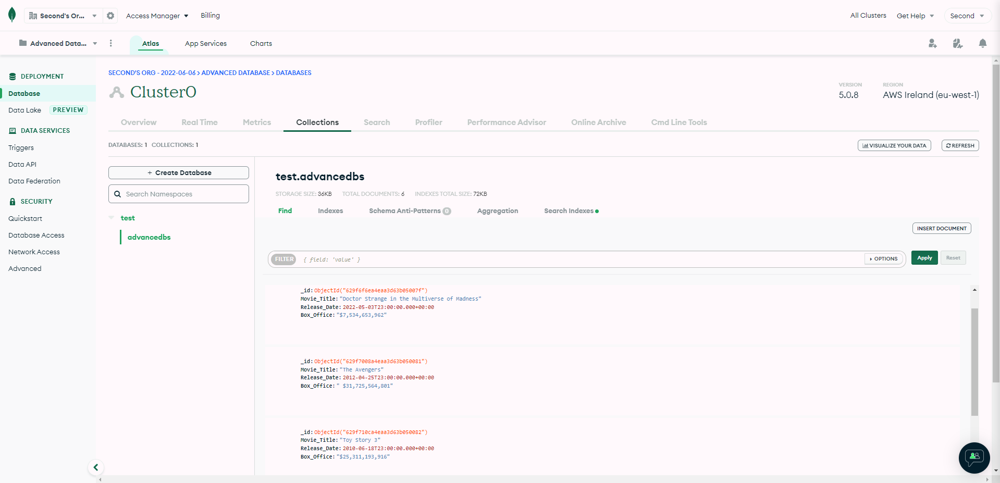

# Online Movie System
## Advance Database Project, using [MongoDB](www.mongodb.com/) and [NodeJS](nodejs.org/en/).
For this website i have chosen to make a website that lets users add movies to the collection. The website already has a few movies viewable.
I have created this website using a non relational database. I have hosted this database online in [Atlas](https://www.mongodb.com/atlas)
### The following modules have been used in this project:
- [express](www.npmjs.com/package/express)
- [morgan](www.npmjs.com/package/morgan)
- [nodemon](www.npmjs.com/package/nodemon)
- [ejs](www.npmjs.com/package/ejs)
- [body-parser](www.npmjs.com/package/body-parser)
- [dotenv](www.npmjs.com/package/dotenv)
- [mongoose](www.npmjs.com/package/mongoose)
- [axios](www.npmjs.com/package/axios)

In my [home page](...), there are:
- New Movies Button
- Update Movies Button
- Delete Movies Button

The Home page displays all the movies currently available in the database.

### The home page
* You can view all the movies in the list from the home page. As mentioned above, you can use the 3 available buttons to navigate between the below pages. 


### The new movies page
* The [New Movies page](), has a form that uses javascript together with other modules to add the new movie data to the database which becomes visible in the home page.
* You can read this page upon clicking the New Movies Button
* The new movies page has a All movies button which redirects users to the home page.

```
exports.create=(req,res)=>{
    if(!req.body){
        res.status(400).send({message:"Content can not be empty!"});
        return;
    }

    const movie=new Advancedb({
        title:req.body.Movie_Title,
        Release_Date:req.body.Release_Date,
        Box_Office:req.body.Box_Office
    })

    movie
    .save(movie)
    .then(data=>{
        res.redirect('/add-movie');
    })
    .catch(err=>{
        res.status(500).send({
            message:err.message||"Some error has occured while creating a create operation"
        });
    });
}
```
### The update movies page
* The [Update Movies page]() is a page that allows users to modify the data of the movies. Since the website was meant to be shared to the public, no security has been implemented for the update protocol. 
* You can read this page upon clicking the Update Movies Button
* The update movies page also has a All movies button which redirects users to the home page.

```
exports.update=(req,res)=>{
    if(!req.body){
        return res.status(400).send({message:"Movie must not be empty to be updated"})
    }
    const id=req.params.id;
    Advancedb.findByIdAndUpdate(id,req.body,{UseFindAndModify:false}).then(data=>{
        if(!data){
            res.status(404).send({message:`Cannot update user with ${id}. User not found!`})
        }else{
            res.send(data)
        }
    }).catch(err=>{
        res.status(500).send({message: "Error, Update user information"})
    })
    
}
```

### The delete button
* We have not created a new page for delete option, instead we can use the delete icon from the home page to delete any of the movies which needs to be removed.
* We have implemented that user gets asked for confirmation before the delete action and recieves a notification upon successful deletion.
```
if(window.location.pathname == "/"){
    $ondelete = $(".table tbody td a.delete");
    $ondelete.click(function(){
        var id = $(this).attr("data-id")

        var request = {
            "url" : `http://localhost:3000/api/users/${id}`,
            "method" : "DELETE"
        }

        if(confirm("Do you really want to delete this record?")){
            $.ajax(request).done(function(response){
                alert("Data Deleted Successfully!");
                location.reload();
            })
        }

    })
}
```
```

exports.delete=(req,res)=>{
    const id=req.params.id;

    Advancedb.findByIdAndDelete(id)
    .then(data=>{
        if(!data){
        res.status(404).send({message:"Cannot Delete with ${id}, Id is wrong"})
        }else{
            res.send({message:"User Deleted successfully!"})
        }
    }).catch(err=>{
        res.status(500).send({message:"Could not delete user with id=" +id});
    });
}
```

### Main Html code:
```
<!--include header-->
 <%-include('include/_header')%>
<!--include header-->
 <!--Main site-->
<main id="site-main">
    <div class="container">
        <div class="box-nav d-flex justify-between">
            <a href="/add-movie" class="border-shadow">
                <span class="text-gradient">New Movie<i class="fa-solid fa-film"></i></span>
            </a>
        </div>

        <!--form handling-->
        <form action="/" method="POST">
            <table class="table">
                <thead class="thead-dark">
                    <tr>
                        <th>ID</th>
                        <th>Movie Title</th>
                        <th>Release Date</th>
                        <th>Box Office</th>
                        <th>action</th>
                        
                    </tr>
                </thead>
                <tbody>
                   <%-include('include/_show')%>
                </tbody>
            </table>
        </form>
        <!--/form handling-->
    </div>
</main>
<!--/Main site-->
<!--include footer-->
<%-include('include/_footer')%>
<!--include footer-->
```
### Javascript:
```
$("#add_movie").submit(function(event){
    alert("Data Inserted Successfully");
})

$("#add_movie").submit(function(event){
    event.preventDefault();

    var unindexed_array=$(this).serializeArray();
    var data= {}

    $.map(unindexed_array, function(n,i){
    data[n['name']]=n['value']
    })
    console.log(unindexed_array);

    var request = {
        "url": 'http://localhost:3000/api/movies/${data.id}',
        "method":"PUT",
        "data":data
    }
    $.ajax(request).done(function(response){
        alert("Data Updated Succesfully")
    })
})


if(window.location.pathname == "/"){
    $ondelete = $(".table tbody td a.delete");
    $ondelete.click(function(){
        var id = $(this).attr("data-id")

        var request = {
            "url" : `http://localhost:3000/api/users/${id}`,
            "method" : "DELETE"
        }

        if(confirm("Do you really want to delete this record?")){
            $.ajax(request).done(function(response){
                alert("Data Deleted Successfully!");
                location.reload();
            })
        }

    })
}
```

### Database
* We have used MongoDB cloud as the database for this project. This helps when hosting website because we will not lose the data in case of physical crash of our system, and it also
makes it easier for others to access it.
* It is security protected with the username being "Aagash" and password being "Aagash21"
* We connect the database to our website using [dotenv](www.npmjs.com/package/dotenv) and [mongoose](www.npmjs.com/package/mongoose). In the config.env file you can see that apart from localhost set as 3000, we also have connection to db database, with the password being manually entered by us. This is an important point to consider because without it we can not connect to the online database and make changes.


```
const mongoose=require('mongoose');

const connectDB = async()=>{
    try{
        const con=await mongoose.connect(process.env.MONGO_URI,{
            
        })

        console.log(`MongoDB connected:${con.connection.host}`);
    }catch(err){
        console.log(err);
        process.exit(1);
    }
}

module.exports=connectDB
```


* As you can notice above, we have made use of mongodb and we can observe how the data is displayed in the database.
* Below is the schema we have used for the purpose:
```
const mongoose=require('mongoose');

var schema=new mongoose.Schema({
    Movie_Title:{
        type:String,
        require:true,
        unique:true
    },
    Release_Date:{
        type:Date,
        required:true
    },
    Box_Office:{
        type:Number,
        required:true
    }
})

const Advancedb=mongoose.model('advancedb',schema);

module.exports=Advancedb;
```
### Packages
You can view every modules we have used in package.json, We have used all these modules for various reasons:
* Express because it helps to rapidly develop application
* Morgan which can be used to log messages everytime we make requests
* Nodemon which restarts server automatically when we make changes, extremely useful since you can keep an eye on the changes you are making in your
website while coding without using "ctrl + s" everytime, efficiency is afterall one of the key targets of computer science.
* Ejs was used as a template engine to create dynamic html pages
* Body-parser serializes data and enable access to form data using body property
* Dotenv was used to separate secret from sourcecode so we can share sourcecode but not database 
* Mongoose was used to connect to mongodb
* Axios makes it easier to make requests in express application

```
{
  "name": "advanced-database-project",
  "version": "1.0.0",
  "description": "Advanced Database Project using mongodb",
  "main": "server.js",
  "scripts": {
    "test": "echo \"Error: no test specified\" && exit 1",
    "start": "nodemon server.js"
  },
  "keywords": [
    "Advanced Database Project",
    "mongodb"
  ],
  "author": "Aagash Rasalingam",
  "license": "ISC",
  "dependencies": {
    "axios": "^0.27.2",
    "body-parser": "^1.20.0",
    "dotenv": "^16.0.1",
    "ejs": "^3.1.8",
    "express": "^4.18.1",
    "mongoose": "^6.3.5",
    "morgan": "^1.10.0",
    "nodemon": "^2.0.16"
  }
}
```

### Server
We have created the server for the application using the above mentioned modules.

```
const express = require('express');
const dotenv = require('dotenv');
const morgan = require('morgan');
const bodyparser = require('body-parser');
const path = require('path');
const { use } = require('express/lib/application');

const connectDB=require('./server/database/connection');

const app = express();

dotenv.config({path:'config.env'})
const PORT =process.env.PORT||8080

app.use(morgan('tiny'));

connectDB();
 
app.use(bodyparser.urlencoded({extended:true}));

app.set('view engine','ejs');

app.use('/css',express.static(path.resolve(__dirname, 'assets/css')));
app.use('/images',express.static(path.resolve(__dirname, 'assets/images')));
app.use('/js',express.static(path.resolve(__dirname, 'assets/js')));

app.use('/',require('./server/routes/router'))

app.listen(PORT,()=>{console.log(`Server is listening on http://localhost:${PORT}`)});
```
### Conclusion
* User can host the page from the local pc using the .env file and changing 
local host to their desire port. 

